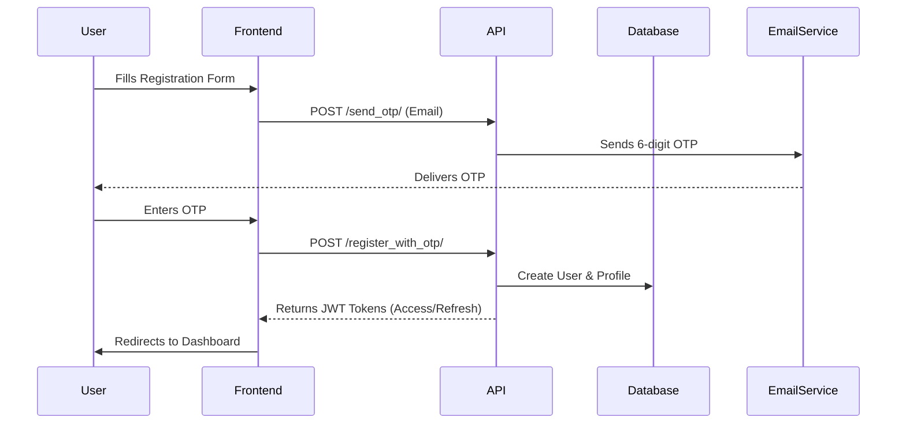
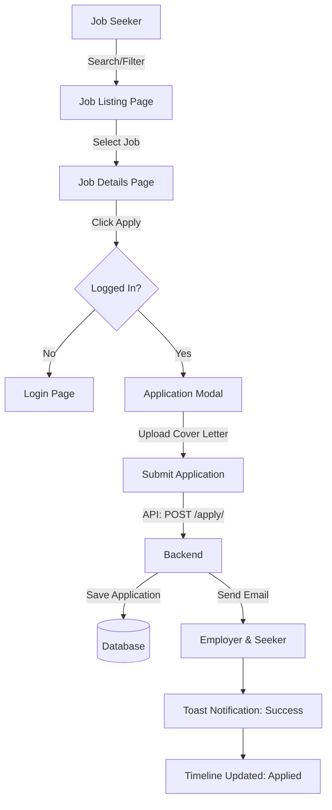

# DreamRoute Job Portal - Comprehensive Documentation

## 1. 🌟 Introduction
DreamRoute is a modern, full-stack recruitment platform designed to bridge the gap between talent and opportunity. It offers a seamless experience for **Job Seekers** to find and track jobs, and for **Employers** to post vacancies and manage applications efficiently.

### 🛠 Technology Stack
*   **Frontend**: React.js (Vite), TailwindCSS, Lucide Icons
*   **Backend**: Django REST Framework (Python), SimpleJWT
*   **Database**: PostgreSQL / SQLite (Development)
*   **State Management**: React Context (`AuthContext`, `ToastContext`)
*   **Notifications**: SMTP Email Service + In-App Toast Notifications

---

## 2. 🗺️ User Flow Diagrams

### 🔐 Authentication Flow


### 📝 Job Application Flow


### 🤝 Employer Hiring Flow
```mermaid
graph LR
    A[Employer] -->|Post Job| B[Job Board]
    C[Seeker] -->|Apply| B
    B -->|New Application| D[Employer Dashboard]
    D -->|Review Resume| E{Decision}
    E -->|Shortlist| F[Update Status: Shortlisted]
    E -->|Reject| G[Update Status: Rejected]
    F --> H[Notify Seeker (Email/Timeline)]
    G --> H
```

---

## 3. 💻 Frontend Architecture

### 📂 File Structure
```
src/
├── components/          # Reusable UI Blocks
│   ├── JobCard.jsx      # Job display card with hover effects
│   ├── Navbar.jsx       # Responsive navigation
│   ├── Logo.jsx         # Branding component
│   └── ...
├── context/             # Global State
│   ├── AuthContext.jsx  # User session, login/logout logic
│   └── ToastContext.jsx # Global notification system
├── layouts/             # Page Wrappers
│   └── MainLayout.jsx   # Standard layout with Navbar/Footer
├── pages/               # Application Routes
│   ├── Auth/            # Login, Register, OTP
│   ├── Employer/        # Dashboard, Post Job, Applications
│   ├── JobDetailsPage.jsx # Details, Apply, Save logic
│   ├── ProfileDashboard.jsx # User Profile, Timeline, Saved Jobs
│   └── ...
├── utils/               # Helpers
│   ├── apiClient.js     # Axios instance with Interceptors
│   └── formatters.js    # Salary/Date formatting
└── router/              # Navigation
    └── AppRouter.jsx    # Route definitions
```

### 🧩 Key Components

#### `ProfileDashboard.jsx`
*   **Functionality**: Central hub for Job Seekers.
*   **Features**: 
    *   **Profile Strength Meter**: dynamic visual bar based on profile completeness.
    *   **Application Tracking**: Timeline view showing status (Applied -> Viewed -> Decision).
    *   **Saved Jobs**: Quick access to bookmarked roles.
    *   **Resume Preview**: In-browser PDF preview.

#### `ToastContext.jsx`
*   **Purpose**: Replaces native browser alerts with sleek, modern UI notifications.
*   **Usage**: `const { addToast } = useToast(); addToast("Success!", "success")`

#### `JobDetailsPage.jsx`
*   **Interaction**: 
    *   "Apply Now" button triggers a modal.
    *   "Save Job" toggles bookmark state.
    *   Displays similar jobs and rich job description.

---

## 4. 🔗 Backend API Reference

### User Management
*   `POST /api/accounts/auth/register/` - Create account.
*   `POST /api/accounts/otp/send_otp/` - Trigger email verification.
*   `POST /api/accounts/auth/login/` - JWT Login.
*   `GET /api/accounts/job-seekers/my_profile/` - Get current user profile.

### Job Operations
*   `GET /api/jobs/` - List all active jobs (Supports pagination).
*   `POST /api/jobs/` - Post a new job (Employer only).
*   `GET /api/jobs/{id}/` - Retrieve job details.
*   `POST /api/jobs/{id}/save/` - Toggle save status.

### Application System
*   `POST /api/jobs/{id}/apply/` - Submit application.
*   `GET /api/applications/` - List user's applications (Seeker) or received applications (Employer).
*   `PATCH /api/applications/{id}/update_status/` - Change status (Pending/Shortlisted/Rejected).

---

## 5. 🔔 Notification System

### Email Notifications (Backend Signals)
The system uses Django Signals (`post_save`) to trigger emails asynchronously:
1.  **Welcome Email**: Sent upon successful registration.
2.  **Application Received**: Sent to Employer when someone applies.
3.  **Application Submitted**: Sent to Seeker confirming submission.
4.  **Status Update**: Sent to Seeker when Employer changes application status.

### Real-time Feedback (Frontend)
1.  **Loading States**: Buttons show spinners (`Loader2` from Lucide) during API calls.
2.  **Toast Messages**: Instant visual feedback for success/error states (e.g., "Resume Uploaded").
3.  **Timelines**: Visual progress bar in Profile Dashboard tracking application stages.

---

## 6. 🚀 Getting Started

1.  **Clone Repository**: `git clone https://github.com/Sivanarulanbu/jobportal.git`
2.  **Backend Setup**:
    ```bash
    cd job-portal/job_portal_backend
    pip install -r requirements.txt
    python manage.py migrate
    python manage.py runserver
    ```
3.  **Frontend Setup**:
    ```bash
    cd job-portal/job-portal-frontend
    npm install
    npm run dev
    ```
4.  **Visit**: `http://localhost:5173`

---
*Generated by Antigravity AI - 2025*
